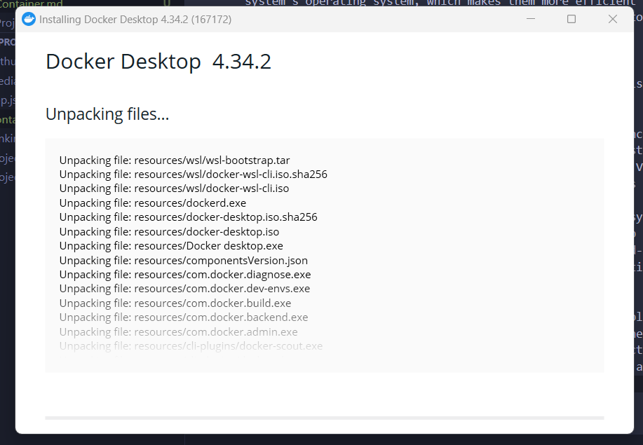
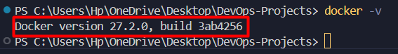
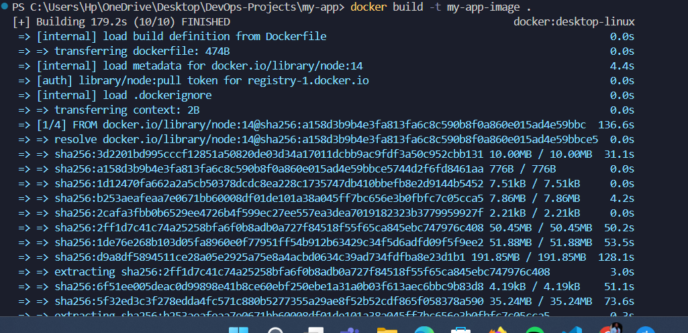
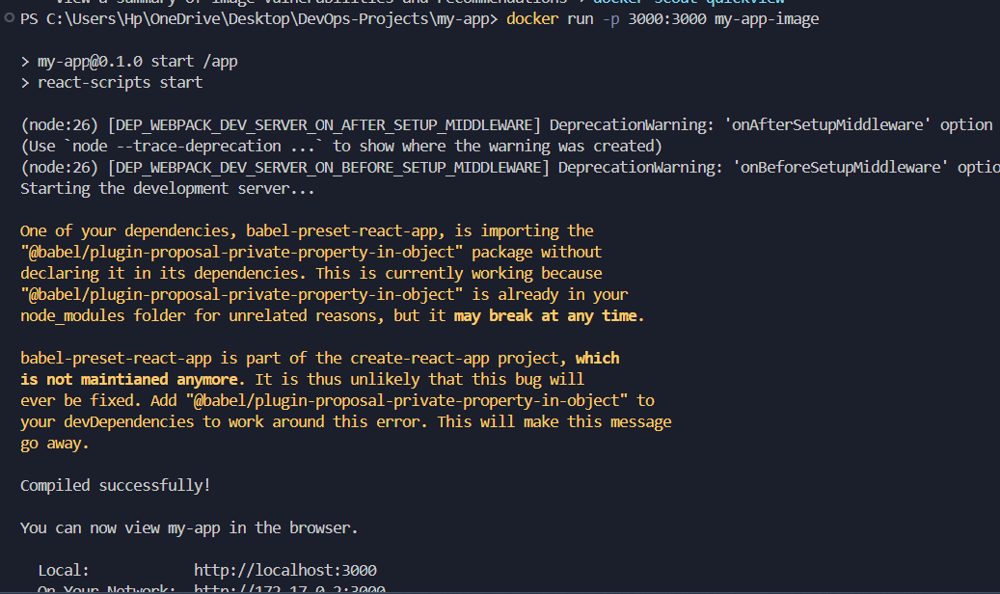
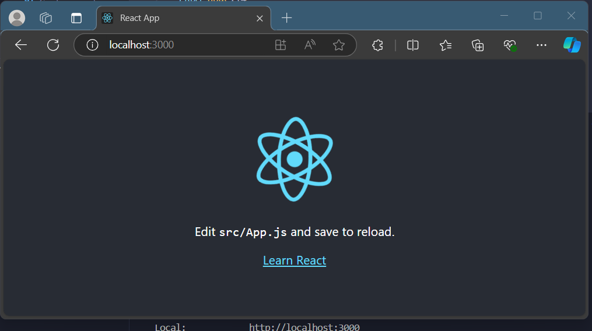
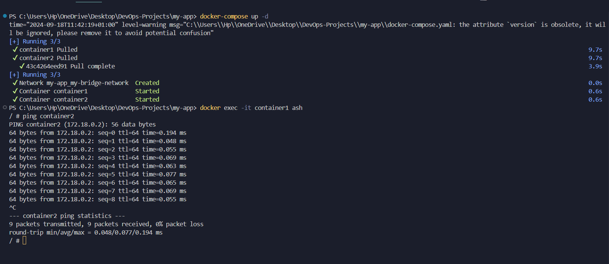

# Containerization: An Overview

## Definition and Purpose of Containerization

Containerization is a technology that packages an application and its dependencies into a single, lightweight executable unit called a "container." The primary purpose of containerization is to ensure that software runs consistently across different computing environments. A container includes everything necessary to execute an application: code, runtime, libraries, environment variables, and configuration files. These containers can run on any system that has a container runtime, such as Docker or Kuber...

The core idea behind containerization is to isolate applications from the host system and other applications running on it. This isolation ensures that the application behaves the same way regardless of where it is deployed—whether on a developer’s laptop, in a test environment, or in a production server. This consistency is crucial in modern software development pipelines where applications move through multiple stages of testing, deployment, and scaling.

## Advantages of Containerization for Consistency and Scalability

One of the primary advantages of containerization is **environment consistency**. Because containers bundle all dependencies required to run the application, there are no discrepancies between different environments. Developers no longer have to worry about the phrase "it works on my machine" since containers ensure that the same application will run identically across development, testing, and production environments.

Another key advantage is **scalability**. Containers are lightweight, with minimal overhead, allowing many containers to run on a single host. This makes it easy to scale applications by deploying multiple container instances across a cluster. Tools like Kubernetes automate the orchestration and scaling of containers, enabling applications to handle variable workloads seamlessly.

Containerization also enhances **resource efficiency**. Unlike traditional virtual machines (VMs), containers share the host system's operating system, which makes them more efficient in terms of CPU, memory, and storage usage. This lightweight nature makes containers faster to start, stop, and replicate compared to VMs, improving overall system performance.

## Comparison of Containerization vs. Virtualization

Although both containerization and virtualization aim to isolate applications and provide a consistent environment, they differ significantly in their architecture and use cases.

In traditional **virtualization**, each virtual machine includes its own guest operating system along with the application and its dependencies. VMs are isolated from each other and the host system through a hypervisor. This approach provides complete isolation but comes at the cost of higher resource usage since each VM requires its own OS, consuming more memory and processing power. VMs are ideal for running multiple different operating systems on a single machine or when full isolation and security ar...

**Containerization**, on the other hand, shares the host system's operating system, with each container running as a lightweight process on the host. This approach provides faster startup times and uses far fewer resources. Containers can spin up or shut down in seconds, making them ideal for dynamic scaling in cloud-native environments. However, because containers share the same kernel, they may not provide the same level of security and isolation as virtual machines.

## Use Cases:
- **Virtualization** is often used in scenarios where complete isolation is required, such as running different operating systems on the same physical server or hosting multiple clients on the same hardware in a cloud environment.
- **Containerization** is ideal for microservices architectures, where applications are split into smaller, independent services that need to be deployed, scaled, and managed dynamically across multiple environments.

# Docker

## Docker Architecture Overview
Docker is a platform designed to automate the deployment, scaling, and management of applications through containerization. Its architecture consists of several key components that work together to manage containers and ensure efficient application deployment.

- **Docker Daemon**: The Docker Daemon (dockerd) is the core engine of Docker. It runs on the host machine and manages all Docker objects, including containers, images, volumes, and networks. The daemon listens for Docker API requests and handles tasks such as container lifecycle management, building images, and orchestrating containers. It is responsible for creating and managing Docker resources and interacting with the underlying operating system to allocate the necessary resources for containers.

- **Docker Client**: The Docker Client (docker CLI) is the primary interface through which users interact with the Docker Daemon. It allows users to send commands (like starting or stopping containers, pulling images, etc.) to the Docker Daemon. The client communicates with the daemon using REST APIs, making it possible to control the daemon locally or remotely.

- **Docker Images**: Docker Images are immutable, read-only templates that contain the instructions for creating Docker containers. An image typically consists of an application and all of its dependencies, libraries, and environment configurations. Images are built using Dockerfiles, which contain instructions on how to build and package the application.

- **Docker Containers**: A Docker Container is a runtime instance of a Docker image. Containers are lightweight, isolated environments that encapsulate the application and its dependencies, running in a consistent and portable environment across different platforms.

- **Docker Registries**: Docker Registries, such as Docker Hub or private registries, are repositories where Docker images are stored and distributed. Users can pull images from registries to create containers or push their own images to share with others.
## Docker Installation
### Step 1: Download Docker Desktop for Windows

1. Visit the official Docker Desktop download page:  
   [Docker Desktop for Windows](https://www.docker.com/products/docker-desktop).
   
2. Click **"Download for Windows"** to download the Docker Desktop installer.

### Step 2: Install Docker Desktop

1. **Run the Installer**:
   - Once the download is complete, run the `.exe` file.
   - Follow the installation prompts.
   - Ensure that the **“Enable WSL 2”** option is checked during installation. This allows Docker to run on the Windows Subsystem for Linux (WSL 2), improving performance.
   - 

2. **Windows Subsystem for Linux (WSL 2)**:
   - If you don’t have WSL 2 enabled, Docker Desktop will prompt you to install it.
   - Follow the prompts to install and configure WSL 2, as Docker works best with WSL 2 on Windows.

### Step 3: Start Docker Desktop

1. After installation, start Docker Desktop from the **Start Menu** or by searching for "Docker Desktop" in the Windows search bar.

2. **Wait for Docker to Initialize**:
   - The Docker whale icon should appear in the system tray (bottom-right corner).
   - Docker may take a few moments to start for the first time.
### Step 4: Verify the Installation

1. **Open Command Prompt (CMD) or PowerShell**:
   - Open a terminal window (CMD, PowerShell, or Windows Terminal).

2. **Check Docker Version**:
   ```bash
   docker --version
**Document**


## Docker Hands-on
Using the contents contained in [My-App](.my-app), the [Dockerfile](my-app/Dockerfile) shows the configuration of the container.



### **Result**


## Docker Network
Checkout the configuration in the [Docker-Compose](my-app/docker-compose.yaml)

