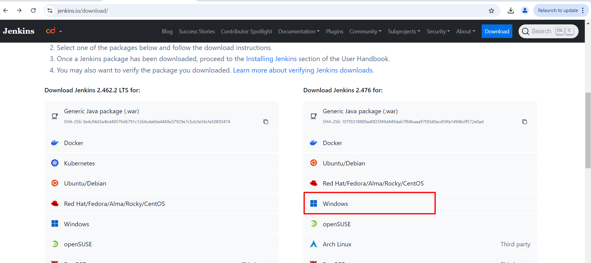
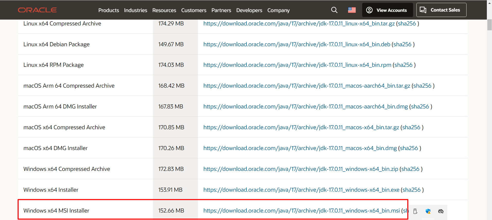
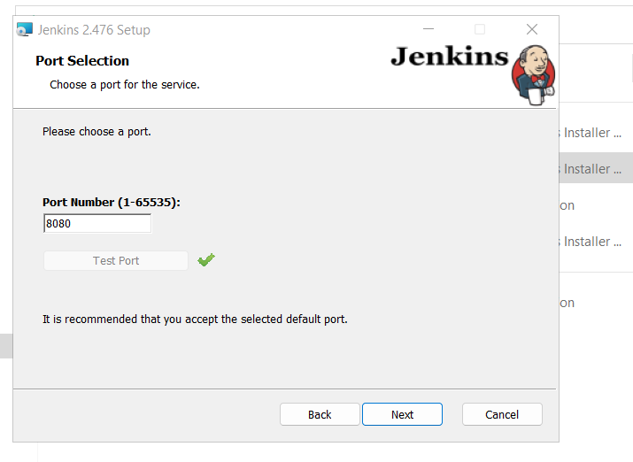
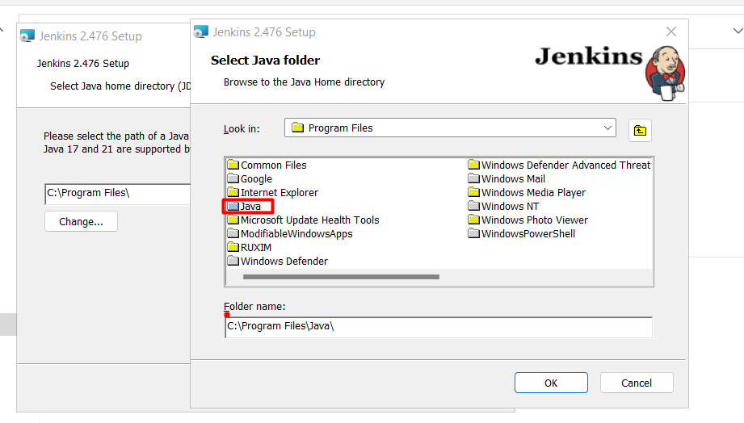
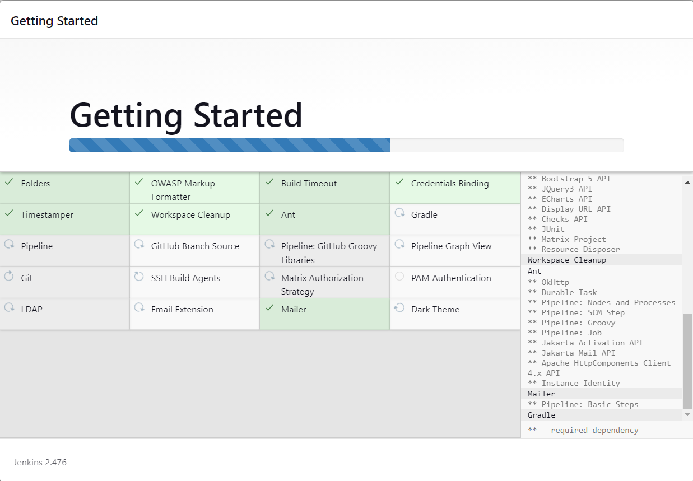

# Jenkins Setup Documentation

## 1. Set Up Jenkins

### Install Jenkins
- **Install Jenkins** on your local machine or a cloud server (e.g., AWS, Azure, GCP).
  - **Steps for Installation**:
    1. Download the Jenkins installer from the [official website](https://www.jenkins.io/download/).
    2. Follow the platform-specific instructions (Linux, Windows, macOS) to install Jenkins.
    3. For cloud environments, spin up a virtual machine (VM) and configure access to the internet.
  
- **Documentation**:
  
  

### Initial Configuration
- **Complete the Initial Setup Wizard**:
  1. Once Jenkins is installed, navigate to `http://localhost:8080` or your cloud server's IP.
  2. Unlock Jenkins by entering the initial admin password (found in the Jenkins home directory).
- **Documentation**:
  
  
  
  
  
- **Install Suggested Plugins**:
  - Jenkins provides a set of recommended plugins that streamline the setup process.
  - During the initial configuration, opt to **install suggested plugins**.  
  - **Document**:
    

- **Create Admin User and Configure Security**:
  1. After the plugins are installed, create an **admin user**.
  2. Configure **basic security settings**, including password and user roles.
  3. Optionally, enable **role-based access control** (RBAC) and configure Multi-Factor Authentication (MFA) for added security.
  
- **Documentation**:
  
  

# Exploring and Installing Essential Jenkins Plugins

## 1. Git Plugin
- **Purpose**: This plugin integrates Jenkins with Git, allowing you to pull code from Git repositories for builds.
- **Usage**:
  - After installation, configure Jenkins to connect to Git repositories by navigating to **Manage Jenkins > Configure System > Git**.
  - You can set up credentials for private repositories.
  - Git plugin is essential for projects that use Git version control.
- **Installation**:
  - Go to **Manage Jenkins > Manage Plugins > Available** and search for "Git Plugin".
  - Install the plugin and restart Jenkins if necessary.
- **Documentation**:

## 2. Pipeline Plugin
- **Purpose**: Enables Jenkins to define build pipelines as code using a `Jenkinsfile`. It allows for advanced CI/CD workflows using Groovy scripts.
- **Usage**:
  - Once installed, you can create a new "Pipeline" job and write your pipeline in a `Jenkinsfile`.
  - This enables the automation of build, test, and deployment steps.
- **Installation**:
  - Go to **Manage Jenkins > Manage Plugins > Available** and search for "Pipeline".
  - Install the plugin.
- **Documentation**:
  

## 3. Email Extension Plugin
- **Purpose**: Allows you to configure custom email notifications when builds fail, succeed, or reach specific stages.
- **Usage**:
  - Configure the plugin in **Manage Jenkins > Configure System > Email Notification**.
  - You can set custom recipients, subject lines, and email triggers.
- **Installation**:
  - Search for "Email Extension" under **Available Plugins** and install it.
  - Restart Jenkins and configure the plugin in build jobs.
- **Documentation**:
  

## 4. JUnit Plugin
- **Purpose**: Enables Jenkins to process and display JUnit test results. It's essential for projects using unit tests written in Java or any language that generates JUnit-compatible reports.
- **Usage**:
  - After adding the plugin, configure your project to publish JUnit test results.
  - Jenkins will display test results, failure trends, and reports in the job summary.
- **Installation**:
  - Search for "JUnit Plugin" under **Available Plugins** and install it.
  - Configure it under job settings to publish test results.
- **Documentation**:
  

## 5. Blue Ocean Plugin
- **Purpose**: Provides a modern, user-friendly UI for Jenkins, making it easier to visualize pipelines, stages, and build statuses.
- **Usage**:
  - After installation, navigate to the **Blue Ocean** view for a more intuitive and visual approach to working with Jenkins pipelines.
  - It provides a graphical view of the pipeline, with clear indicators of success or failure in different stages.
- **Installation**:
  - Search for "Blue Ocean" in the plugin manager and install it.
- **Documentation**:
  
---

### Installation Steps for Each Plugin:

1. **Navigate to the Plugin Manager**:
   - Go to **Manage Jenkins > Manage Plugins > Available**.
2. **Search for the Plugin**:
   - In the search bar, type the name of the plugin (e.g., "Git Plugin").
3. **Install the Plugin**:
   - Check the box next to the plugin and click **Install without Restart** (or choose to restart if recommended).
4. **Configure the Plugin**:
   - Each plugin might need additional configuration, which can be found under **Manage Jenkins > Configure System** or in the job settings.

# Jenkins Freestyle Project Documentation

## 1. Create a Simple "Hello World" Jenkins Freestyle Job

### Step-by-Step Instructions:

1. **Create a New Freestyle Project**:
   - Go to your Jenkins dashboard.
   - Click on **New Item**.
   - Enter a name for your project (e.g., `HelloWorld`).
   - Select **Freestyle project**, then click **OK**.
   - You will be redirected to the project configuration page.

2. **Configure the Job to Run a Shell Script**:
   - Scroll down to the **Build** section.
   - Click on **Add build step** and select **Execute shell**.
   - In the command box, enter the following script:
     \`\`\`bash
     echo "Hello, World!"
     \`\`\`
   - This script will print "Hello, World!" to the console when the job is run.

3. **Save and Run the Job**:
   - Click **Save** to store the job configuration.
   - To run the job, click **Build Now** in the project dashboard.
   - Check the console output by clicking on the build number under **Build History** and selecting **Console Output**.
   
---

## 2. Parameterized Builds

### Step-by-Step Instructions to Modify the Job:

1. **Modify the "Hello World" Job to Accept a Parameter**:
   - Go to the **Configure** page for the `HelloWorld` project.
   - Scroll down and check the option **This project is parameterized**.
   - Click on **Add Parameter** and choose **String Parameter**.
   - Set the following:
     - **Name**: `name`
     - **Default Value**: `World`
     - **Description**: "Enter your name"

2. **Modify the Shell Script**:
   - In the **Build** section, update the script to:
     \`\`\`bash
     echo "Hello, \${name}!"
     \`\`\`
   - This will print "Hello, [name]!" where `[name]` is the value of the parameter provided.

3. **Run the Job with Different Parameters**:
   - After saving, go to the project dashboard and click on **Build with Parameters**.
   - Enter a name (e.g., `Ebube`) and click **Build**.
   - Check the console output to see the message:
     \`\`\`
     Hello, Ebube!
     \`\`\`

---

## 3. Build Triggers (Running Job Every 5 Minutes)

### Step-by-Step Instructions to Configure Cron Trigger:

1. **Configure Build Triggers**:
   - Go to the **Configure** page of your `HelloWorld` project.
   - Scroll down to the **Build Triggers** section.
   - Check the option **Build periodically**.
   - In the **Schedule** field, enter the following cron syntax to run the job every 5 minutes:
     \`\`\`
     H/5 * * * *
     \`\`\`
   - The `H/5` ensures that the job will run at regular intervals but at random offsets within the 5-minute window, distributing the load across time.

2. **Save the Configuration**:
   - Click **Save** to store the cron job trigger.

3. **Explanation of Cron Syntax**:
   - **H/5**: Runs the job every 5 minutes, starting at a random time in the 5-minute range (to avoid all jobs running simultaneously).
   - **\***: Wildcards for hour, day of month, month, and day of week, meaning the job will run irrespective of these factors.

4. **Monitor the Job**:
   - Jenkins will automatically run the job every 5 minutes as per the schedule.
   - You can see the job's run history in the **Build History** section of the project dashboard.