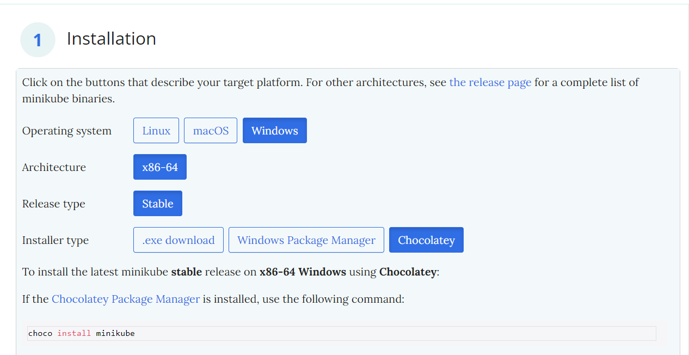
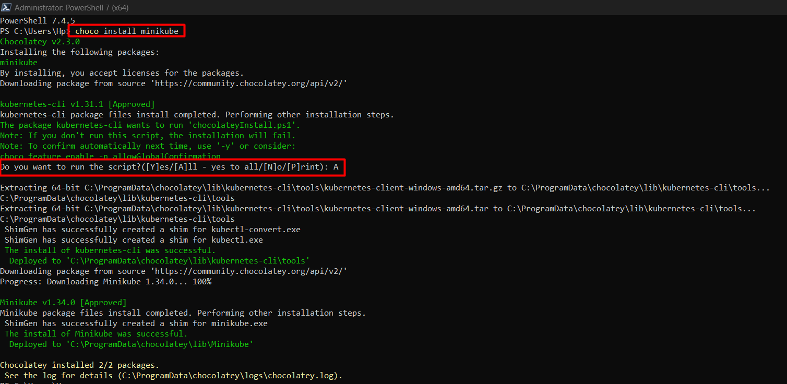

# The Need for Container Orchestration

As the adoption of containerization continues to grow, organizations face the challenge of efficiently managing multiple containers across various environments. While tools like Docker make it easy to create and run containers, manually managing large-scale containerized applications becomes complex. This is where container orchestration comes in, providing a way to automate the deployment, scaling, management, and networking of containers across a distributed infrastructure.

## Container orchestration addresses several key problems:

- **Scaling and Resource Management**:
    In large environments, organizations might need hundreds or thousands of containers running simultaneously. Manually starting, stopping, and managing these containers becomes impractical. Container orchestration automates the scaling of applications by dynamically adding or removing containers based on demand.

- **Service Discovery and Networking**:
    In a microservices architecture, containers need to communicate with each other. Container orchestration solutions provide built-in networking and service discovery features to ensure that containers can easily find and talk to one another without manual intervention.

- **Load Balancing and High Availability**:
    Orchestrators distribute traffic across containers to ensure that no single container is overwhelmed. They can also automatically restart containers that fail and replace unhealthy containers, ensuring high availability and minimal downtime.

- **Self-healing**:
    Orchestration systems can monitor the health of containers and automatically reschedule or restart them if they crash or behave unexpectedly, thereby maintaining the application's stability without human intervention.

- **Security and Isolation**:
    Orchestrators can enforce security policies, isolate sensitive workloads, and ensure that containers have only the necessary permissions to interact with the system and other containers.

## Kubernetes Architecture and Components

Kubernetes, the most widely used container orchestration platform, helps manage containerized applications across a cluster of machines. Kubernetes has a master-worker architecture consisting of master nodes (which control the cluster) and worker nodes (where the applications run).

### vMaster Node Components:
**API Server**:
The API Server is the core component of the Kubernetes control plane. It exposes the Kubernetes API, through which users, administrators, and other components interact with the cluster. All interactions with the cluster, including creating, scaling, and managing containers, go through the API server.

**Scheduler**:
The Scheduler is responsible for deciding which node to assign a new container (or pod). It considers factors like resource requirements, affinity/anti-affinity rules, and workload distribution when selecting the optimal node for a container.

**Controller Manager**:
The Controller Manager runs various controllers that maintain the desired state of the cluster. Examples include the node controller, which monitors the health of nodes, and the replication controller, which ensures the correct number of replicas for a pod.

**etcd**:
etcd is the key-value store that Kubernetes uses to store all cluster data, including configurations, state information, and network settings. It is a consistent and distributed store that acts as the single source of truth for the cluster.

### Worker Node Components:

**Kubelet**:
The Kubelet is an agent that runs on each worker node. It receives instructions from the API Server and ensures that the containers specified in the pod definitions are running and healthy. The Kubelet is responsible for managing the lifecycle of containers on its node.

**Kube-proxy**:
The Kube-proxy is responsible for managing network communication within the cluster. It maintains network rules and routes traffic to the correct containers. It also provides load-balancing for service endpoints across multiple pods.

### Add-ons:

**DNS**:
Kubernetes provides a built-in DNS service that automatically assigns DNS names to services. This allows containers to find and communicate with each other via service names, making service discovery simple and efficient.

**Dashboard**:
The Kubernetes Dashboard is a web-based user interface that allows users to manage and monitor their clusters visually. It provides a way to inspect the health of nodes, view logs, and manage deployments in an easy-to-understand format.

## Minikube

To Install minikube on your local PC go to [Minikube](https://minikube.sigs.k8s.io/docs/start/?arch=%2Fwindows%2Fx86-64%2Fstable%2Fchocolatey) and select the appropriate install based on your local configs.

In this demo I used PowerShell to install minikube.
```PowerShell
choco install minikube
```

After installation run
```bash
minikube start
```
This command will start a minikube server on your PC, depending on the available virtualization software on your PC, the VM will either be created in Hyper-V, VirtualBox, etc.
Now your environment is all set to start running kubernetes clusters locally on your PC.

Below are the Kubernetes manifests for deploying a simple containerized web server such as nginx webserver.
- **Deployment**: 
    Manages the deployment and scaling of the containerized web server. Here is an example for a simple webserver, [Deployment](kube/deployment.yaml).
- **Service**: 
    Exposes the web server to allow external access. Here is an example for a simple webserver, [Service](kube/service.yaml).
- **ConfigMap**: 
    Contains environment variables that the web server can use. Here is an example for a simple webserver, [ConfigMap](kube/configmap.yaml).

**To deploy these manifests, run the following commands**:

To create ConfigMap
```bash
kubectl apply -f configmap.yaml
```
To create deployment
```bash
kubectl apply -f deployment.yaml
```
To create service
```bash
kubectl apply -f service.yaml
```
**Verify deploments**

Check if the pods are running
```bash
kubectl get pods
```
Check if the services are running and exposing the application
```bash
kubectl get svc
```
Get the webserver URL
```bash
minikube service webserver-service
```
### Helm

Insalling helm using chocolatey
```PowerShell
choco install kubernetes-helm
```
Verify installation
```bash
helm version
```
Optionaly you can add Help repo to your Kube cluster
```bash
helm repo add stable https://charts.helm.sh/stable
helm repo update
```
**Create Helm chart**

Using helm create will create a directory containing templates for Helm
```bash
helm create my-webapp-chart
```
The templates needs to be modified to suit your configuration, [Deployment](kube/my-webapp-chart/templates/deployment.yaml), [Service](kube/my-webapp-chart/templates/service.yaml).

**Deploy the Helm chart**

Deploy the helm chart
```bash
helm install my-webapp-release ./my-webapp-chart
```
*my-webapp-release*: The name of Helm release

*./my-webapp-chart*: The Helm chart directory

Check Pod and service
```bash
kubectl get pods
kubectl get svc
```
## Compare Helm Deployment with Raw Manifests
#### Key Differences:
#### Ease of Management:

- **Helm**: 
    Helm provides a more organized and reusable way to manage Kubernetes applications. It allows you to store templates in charts and apply values dynamically across environments (e.g., dev, prod).
- **Raw Manifests**: 
    With raw manifests, you need to manually edit and deploy each file, which can be more cumbersome when managing multiple environments or scaling the application.

#### Upgrade and Rollback:

- **Helm**: 
    Helm provides simple commands for upgrading or rolling back deployments. For example, to upgrade an application:
    ```bash
    helm upgrade my-webapp-release ./my-webapp-chart
    ```
    To rollback a release:
    ```bash
    helm rollback my-webapp-release 1
    ```
- **Raw Manifests**: 
    You would need to manually update each manifest and apply changes using kubectl. Rolling back would involve manually reverting changes.

#### Versioning:

- **Helm**: 
    Helm manages release history, so you can track which versions of the chart were deployed and roll back if needed.

- **Raw Manifests**: 
    Version control is managed through Git, but Kubernetes itself does not maintain any history of manifest deployments.

#### Parameterization:

- **Helm**: 
    Values like replica counts, image versions, and environment-specific variables can easily be parameterized in the values.yaml file, allowing for flexible, environment-specific configurations.
- **Raw Manifests**: 
    You need to manually edit each manifest file to modify configurations, which can lead to errors and inconsistencies.

## Horizontal Pod Autoscaling

To enable HPA, the first step will be to install metrics server.
```bash
kubectl apply -f https://github.com/kubernetes-sigs/metrics-server/releases/latest/download/components.yaml
```
Verify that the metrics server is running.
```bash
kubectl get deployment metrics-server -n kube-system
```
We will now create a Horizontal Pod Autoscaler (HPA) for the web server deployment. The HPA automatically adjusts the number of replicas based on CPU utilization or other metrics. This is refrenced here, [hpa](kube/hpa.yaml) or [HPA](kube/my-webapp-chart/templates/hpa.yaml)

Apply the HPA configuration
```bash
kubectl apply -f hpa.yaml
```
Verify HPA
```bash
kubectl get hpa
```
To observe the scaling behavior, we need to simulate some load on the web server. A common way to do this is by using a tool like kubectl to launch a load-generating container. We will use busybox to generate traffic to the nginx service.

## Step-by-Step Guide for Setting Up Monitoring and Logging in Kubernetes
In this guide, we will set up Prometheus and Grafana for monitoring your Kubernetes cluster and EFK (Elasticsearch, Fluentd, and Kibana) for logging. Both solutions help to monitor the health and performance of your Kubernetes cluster and capture logs from pods and system components.

### Monitoring Setup with Prometheus and Grafana
#### Install Prometheus and Grafana using Helm
    Helm makes it easy to deploy both Prometheus and Grafana. First, ensure Helm is installed, then add the stable Helm repository and install Prometheus and Grafana.

- **Add Helm Repositories**:
```bash
helm repo add prometheus-community https://prometheus-community.github.io/helm-charts
helm repo add grafana https://grafana.github.io/helm-charts
helm repo update
```
- **Install Prometheus: Use the following command to install Prometheus in your Kubernetes cluster**:
```bash
helm install prometheus prometheus-community/kube-prometheus-stack --namespace monitoring --create-namespace
```
- **Install Grafana: Install Grafana with the following command**:
```bash
helm install grafana grafana/grafana --namespace monitoring
```
- **Get Grafana Admin Password: After installation, get the password for Grafana’s admin user**:
```bash
kubectl get secret --namespace monitoring grafana -o jsonpath="{.data.admin-password}" | base64 --decode ; echo
```
- **Access Grafana Dashboard**:

    Port forward Grafana to access it on your browser:
    ```bash
    kubectl port-forward --namespace monitoring svc/grafana 3000:80
    ```
    Open http://localhost:3000 in your browser.
    Log in using admin as the username and the password you retrieved earlier.
#### Configure Grafana Dashboards for Kubernetes Metrics
- **Add Prometheus as a Data Source**:

    In Grafana, go to Configuration > Data Sources.
    Click on Add data source and select Prometheus.
    Use the Prometheus service URL in Kubernetes (typically http://prometheus-server.monitoring.svc.cluster.local:9090).
    Click Save & Test to verify the connection.
- **Import Kubernetes Dashboards**:

    Go to Dashboard > Import.
    Use the following dashboard IDs to import predefined Kubernetes dashboards:
    Prometheus Kubernetes Metrics: 3119
    Kubernetes Cluster Monitoring: 6417
    This will add pre-configured dashboards for monitoring your Kubernetes cluster.
